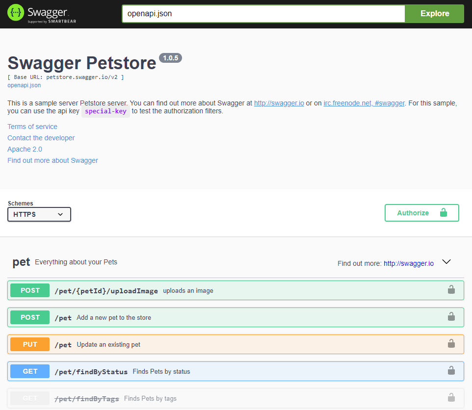

# swagger-ui

Swagger-ui is a crate to use in rust web-servers to render
OpenAPI specification, using [swagger-ui JS library](https://www.npmjs.com/package/swagger-ui).

This crate downloads [swagger-ui-dist](https://www.npmjs.com/package/swagger-ui-dist) from npm 
during build and 
embeds it into your binary, using [rust-embed](https://crates.io/crates/rust-embed).

It also provides bindings for [rocket](https://rocket.rs).



## Usage

### Rocket

Use this crate with rocket to serve `swagger-ui` for your OpenAPI specification.

Use `rocket` feature in your `Cargo.toml`:
```toml
swagger-ui = { version = "0.1", features = ["rocket"] }
```

Or install `rocket-swagger-ui`:
```toml
swagger-ui = "0.1"
rocket-swagger-ui = "0.1"
```

See [rocket-swagger-ui/examples/basic.rs](../rocket-swagger-ui/examples/basic.rs)
for a full example:

```rust
#![feature(proc_macro_hygiene, decl_macro)]

extern crate rocket;

use rocket_swagger_ui;
use swagger_ui;

fn main() {
    rocket::ignite()
        .mount("/api/v1/swagger/",
               rocket_swagger_ui::routes(
                   // Specify file with openapi specification,
                   // relative to current file
                   swagger_ui::swagger_spec_file!("./openapi.json"),
                   swagger_ui::Config { ..Default::default() }
               )
        )
        .launch();
}
```

### Standalone

This library isn't really useful without webserver bindings.
You can get files from `swagger-ui-dist` and create configuration 
for `swagger-ui`, which can be serialized to json via [serde](https://docs.rs/serde/).

See [../swagger-ui/examples/basic.rs](../swagger-ui/examples/basic.rs)
for a full example:

```rust
use swagger_ui::{Assets, Config, Spec, DefaultModelRendering, DocExpansion, Filter, swagger_spec_file};

fn main() {
    println!("swagger-ui bundles files:");
    // Use Assets::iter() to get iterator of all filenames
    for file in Assets::iter() {
        let filename = file.as_ref();
        println!("\t{}", filename);
        // `Assets::get(filename)` returns file content
    };

    // Load openapi spec (compile-time)
    let _spec: Spec = swagger_spec_file!("./openapi.json");

    // swagger-ui configuration struct
    let _config: Config = Config {
        url: "".to_string(),
        urls: vec![],
        deep_linking: false,
        display_operation_id: false,
        default_models_expand_depth: 0,
        default_model_expand_depth: 0,
        default_model_rendering: DefaultModelRendering::Example,
        display_request_duration: false,
        doc_expansion: DocExpansion::List,
        filter: Filter::Bool(false),
        max_displayed_tags: 0,
        show_extensions: false,
        show_common_extensions: false
    };
}
```